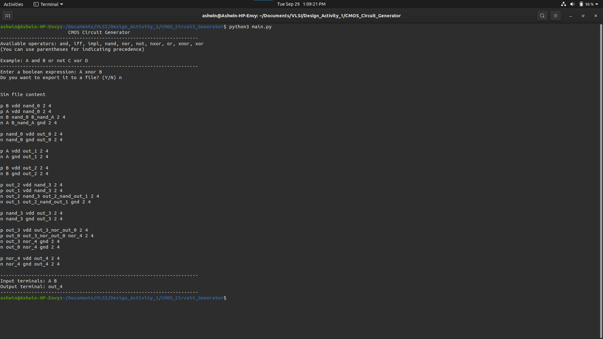

# CMOS Circuit Generator

Converting Boolean Expressions to CMOS Circuits.

## Requirements

- [ttable](https://tt.brianwel.ch/en/latest/)

## Usage

```shell
pip3 install -r requirements.txt

python3 main.py
```

## Information

Available operators: `and`, `iff`, `impl`, `nand`, `nor`, `not`, `nxor`, `or`, `xnor`, `xor`

Example Input: `A and B or not C xor D`

## Sample Outputs


